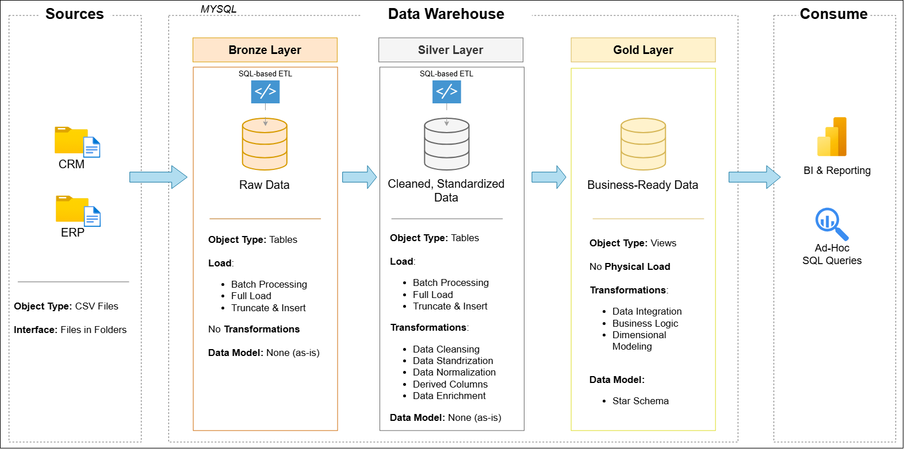
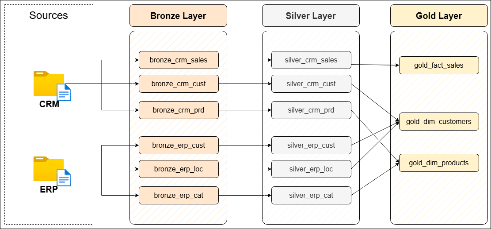
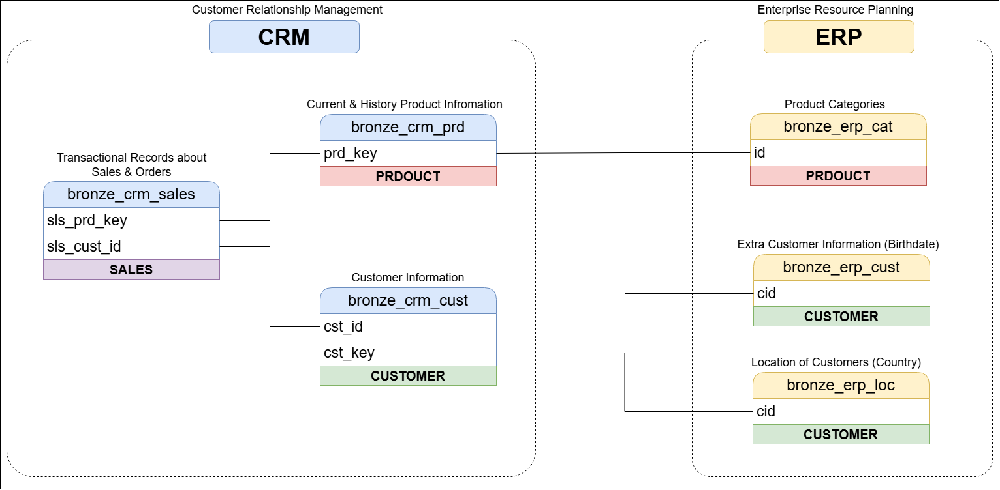
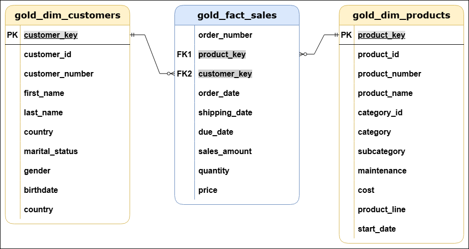
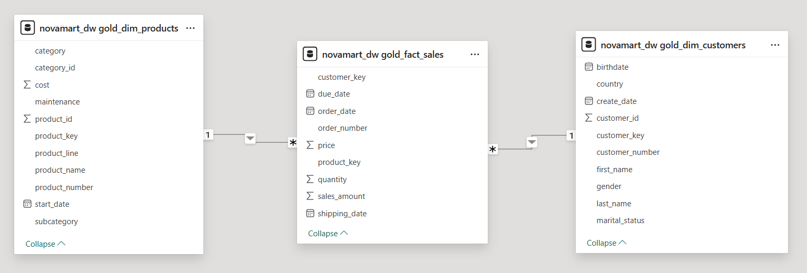
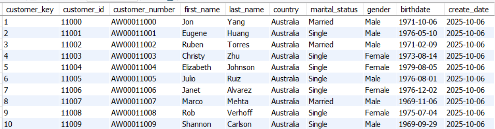
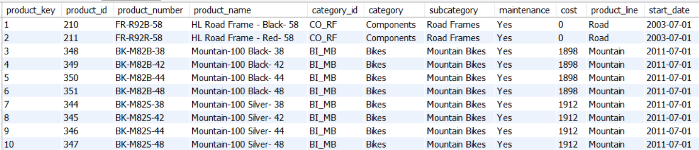
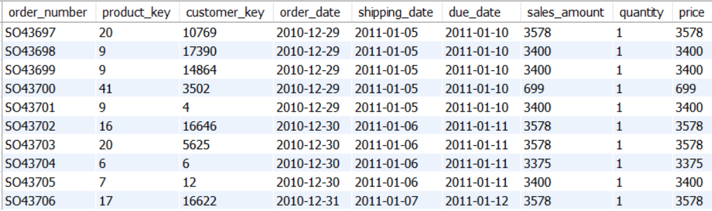

# NovaMart End-to-End Data Warehouse (MySQL)

This project demonstrates the design and implementation of a modern SQL-based Data Warehouse using **MySQL**, following the **Bronze–Silver–Gold architecture**.  
It ingests raw CRM and ERP data from CSV files, cleans and standardizes the data using SQL-based ETL, and exposes a **business-ready Star Schema** for BI tools such as Power BI.

## High-Level Architecture

This diagram shows the overall system design.  
CRM and ERP CSV files are ingested into the Bronze layer, transformed and cleaned in the Silver layer, and exposed as business-ready views in the Gold layer.  
The Gold layer is designed for consumption by BI tools and ad-hoc SQL queries.

## Data Flow (ETL Pipeline)

This diagram represents the end-to-end data flow:
CSV files are loaded into Bronze tables, transformed using SQL-based ETL into Silver tables, and finally modeled as Gold views.

## Data Integration (CRM & ERP)

This diagram explains how CRM and ERP source systems are related.
CRM provides transactional and core master data, while ERP enriches customer and product information.
These relationships are resolved during the Silver and Gold layers.

## Data Model (Gold Layer – Star Schema)

The Gold layer follows a **Star Schema** design:
- `gold_fact_sales` as the central fact table
- `gold_dim_customers` and `gold_dim_products` as dimensions

This structure is optimized for analytics and reporting.

## Gold Layer Validation in Power BI

This screenshot shows the Gold layer imported into Power BI.
The fact table is correctly connected to the dimension tables using surrogate keys, confirming a valid Star Schema with one-to-many relationships.

## Gold Layer Output (Business-Ready Data)

These screenshots show sample records from the Gold views.
The data is clean, standardized, and ready for analytics.

## Data Layers Overview

**Bronze Layer**
- Raw data storage
- One-to-one mapping with source CSV files
- No transformations applied

**Silver Layer**
- Data cleansing and standardization
- Handling invalid values and dates
- Deduplication and validation
- Integration of CRM and ERP data

**Gold Layer**
- Business-ready views
- Star Schema modeling
- No physical data load (logical views)
- Optimized for BI tools

## Data Sources

The project integrates six CSV files from two systems:

**CRM**
- Customer Information
- Product Information
- Sales Details

**ERP**
- Customer Demographics
- Customer Location
- Product Categories

All six sources are used and integrated into the final model.

## Technologies Used

- MySQL
- SQL (ETL, Window Functions, Views)
- Power BI
- CSV Data Sources
- Git & GitHub

## Outcome

This project delivers a complete, analytics-ready Data Warehouse implemented using MySQL.
It demonstrates real-world data engineering practices including multi-source integration, data quality handling, and dimensional modeling.

The Gold layer can be directly consumed by BI tools for reporting and analysis.
